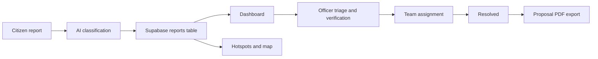
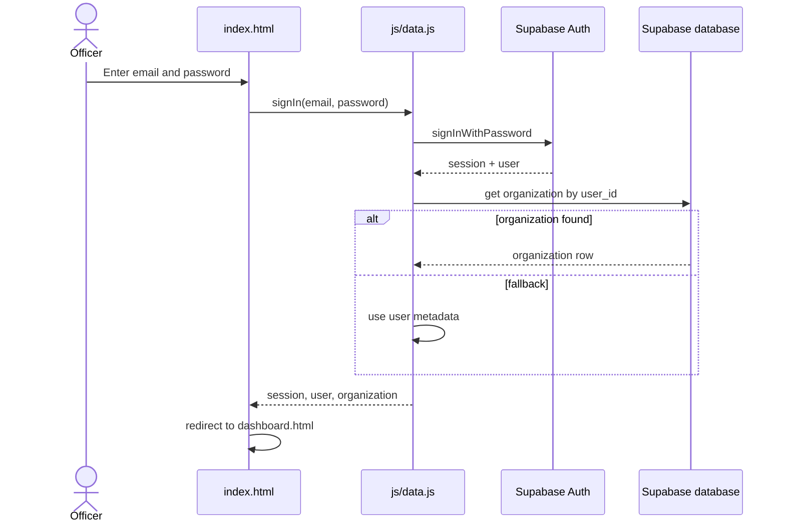

# 🌍 Prakarti Report

<div align="center">
  <p><strong>Environmental Intelligence & Action Platform</strong></p>
  <p><strong>Officer and specialist dashboard for Delhi-NCR environmental monitoring, verification, and coordinated action.</strong></p>
  
  
  
  
  
  
  
</div>

---

## Table of Contents

- [What is this project?](#-what-is-this-project)
- [Key features](#-key-features)
- [How it works (workflow)](#-how-it-works-workflow)
- [Tech stack](#-tech-stack)
- [Architecture](#-architecture)
- [Project structure](#-project-structure)
- [Database](#-database)
- [Getting started](#-getting-started)
- [Configuration](#-configuration)
- [Deployment](#-deployment)
- [Security notes](#-security-notes)
- [Known limitations](#-known-limitations)
- [Contributing](#-contributing)

---

## 🌍 What is this project?

Prakarti Report is the officer and specialist dashboard for a two-part environmental monitoring system for the Delhi-NCR region. Citizens submit reports through a separate Citizen Reporting App. This project is the operational dashboard used by officers, specialists, and teams to inspect, verify, assign, and act on those reports.

This project focuses on Delhi, Noida, Greater Noida, and Ghaziabad. The citizen app and the dashboard share one Supabase project and work from the same core data. The dashboard turns incoming issue reports into triage queues, map views, hotspot analysis, team assignment, and proposal export.

| Part | Who uses it | What it does |
| --- | --- | --- |
| Citizen Reporting App | Residents, local reporters, field observers | Submits photos and GPS locations of suspected pollution or waste issues |
| Prakarti Report Dashboard | Officers, specialists, field teams, analysts | Reviews AI-detected suspected issues, verifies them, assigns teams, tracks status, and prepares action proposals |

> Responsible-AI note: every submission is treated as an “AI-detected suspected issue.” It is not treated as a confirmed violation until ground verification is complete. The schema and the workflow both require field confirmation before regulatory action.

---

## 🔑 Key features

| Page | File | What you can do |
| --- | --- | --- |
| Sign-in | `index.html` | Begins with Supabase Auth sign-in flow and redirects a valid session to the dashboard |
| Dashboard | `dashboard.html` | Shows KPI cards, chart summaries, and report counts for active incidents |
| Reports | `reports.html` | Filters, searches, sorts, and bulk-selects reports for officer triage and assignment |
| Report details | `report-details.html` | Opens one report, shows evidence, notes, workflow controls, and assignment details |
| Environmental Map | `map.html` | Renders a Leaflet map with incident markers, hotspot buffers, filters, and cluster behaviour |
| Analytics | `analytics.html` | Builds category, status, location, and trend charts from report data |
| Hotspots | `hotspots.html` | Reviews hotspot clusters, density cards, risk levels, and report group details |
| Teams & Specialists | `organizations.html` | Lists teams and specialists, shows membership and team metadata, and supports team creation |
| Proposals | `proposal.html` | Selects reports, builds a remediation proposal, and exports a PDF version |
| Impact | `impact.html` | Reviews resolved and active cases, outcomes, and verification metrics |
| Settings | `settings.html` | Opens the platform settings modal and displays local platform configuration values |

Extras found in code:

- Realtime refresh is wired through `subscribeToChanges()` and is used on the Map, Analytics, and Impact pages.
- A global search box is rendered in the shared app shell.
- The app shell guards pages by checking the current Supabase session and redirecting unauthenticated users to `index.html`.
- The shared sidebar and top bar are responsive and support the mobile drawer layout.

---

## 🧭 How it works (workflow)

### 1) End-to-end flow



### 2) Report lifecycle

```mermaid
stateDiagram-v2
    [*] --> Reported
    Reported --> AI_Analyzed
    AI_Analyzed --> Under_Review
    Under_Review --> Verified
    Verified --> Action_Initiated
    Action_Initiated --> Resolved
    Under_Review -.-> Rejected
    Verified -.-> Rejected
    Action_Initiated -.-> Rejected
    Resolved --> [*]
    Rejected --> [*]
```

Note: the database stores lowercase snake_case values such as `under_review`. The UI maps those values to display labels like “Under Review”.

### 3) Login flow



### 4) Hotspot detection logic

The logic is implemented in `getHotspots()` in `js/data.js`.

1. There are 8 predefined NCR zones, with radii between 2000 and 3500 meters.
2. All reports that are not already assigned to a zone are checked against the remaining points and clustered if they are within 2500 meters of one another.
3. A cluster only qualifies as a hotspot if it contains at least `MIN_REPORTS_PER_HOTSPOT = 2` reports.
4. The hotspot radius is set to at least 1500 meters and expands based on the farthest member report.
5. Risk level is assigned from the highest severity found in the cluster: `High` > `Medium` > `Low`.
6. Final hotspots are ranked by report count first, then by high-priority count.

---

## 🛠️ Tech stack

| Layer | Technology | Purpose |
| --- | --- | --- |
| Front end | HTML5, CSS3, vanilla JavaScript | Static app shell, forms, dashboards, and page logic |
| Data access | Supabase JS 2.48.1 | PostgreSQL access, Auth, Realtime, Storage, and row-level security |
| Mapping | Leaflet 1.9.4 + Leaflet.markercluster 1.5.3 | Map rendering and marker clustering |
| Basemap | CARTO Voyager tiles | Background map layer for the NCR map |
| Charts | Chart.js | Dashboard and analytics visuals |
| PDF export | jsPDF 2.5.1 | Proposal and document export |
| Icons | Lucide | UI icons across pages |
| Hosting | Vercel | Static front-end deployment |
| Build tooling | Node.js scripts | Generate `js/config.js` from environment variables |

---

## 🏗️ Architecture

```text
+-------------------+      +------------------------+
| index.html        |      | dashboard.html         |
| reports.html      | ---> | analytics.html         |
| map.html          |      | hotspots.html          |
| proposal.html     |      | organizations.html     |
| impact.html       |      | settings.html          |
+-------------------+      +------------------------+
          |                              |
          v                              v
   +-----------------------+   +-------------------------+
   | js/app.js             |   | js/<page>.js           |
   | shared app shell      |   | page-specific logic    |
   | auth guard + sidebar  |   | filters, charts, maps  |
   +-----------------------+   +-------------------------+
                 \                    /
                  \                  /
                   v                v
                 +---------------------------+
                 | js/data.js               |
                 | window.EarthData         |
                 | Supabase auth + queries   |
                 +---------------------------+
                              |
                              v
                     +----------------------+
                     | Supabase project     |
                     | Auth + Postgres +    |
                     | Realtime + Storage   |
                     +----------------------+
```

Design ideas in this codebase:

- A single data layer in `js/data.js` exposes `window.EarthData` to the pages.
- A shared app shell in `js/app.js` injects the sidebar, top bar, notifications, and session guard.
- Runtime config is generated from environment variables and written to `js/config.js`, so it is not meant to be edited by hand and is excluded from committed deployment state.

---

## 🗂️ Project structure

```text
.
├── .env.example                     # Example environment variables for local setup
├── .gitignore                       # Ignores .env and generated JS config files
├── analytics.html                   # Analytics page and chart layout
├── config.js                        # Generated runtime config file used by the app
├── dashboard.html                   # Dashboard overview and KPI cards
├── hotspots.html                    # Clustered hotspot page and empty states
├── impact.html                      # Verified outcomes and intervention metrics
├── index.html                       # Sign-in page with Supabase Auth
├── map.html                         # Map view with Leaflet, filters, and marker clusters
├── migrations/                      # Local SQL migration files used for schema updates
│   ├── 20260920000001_teams_and_reports_schema.sql
│   └── 20260920000002_add_user_id_to_organizations.sql
├── organizations.html               # Teams, specialists, and org metadata page
├── package.json                     # `build` and `dev` scripts
├── proposal.html                    # Complaint proposal builder and PDF export page
├── report-details.html              # Single report evidence and workflow details
├── reports.html                     # Triage matrix, search, and assignment workflow
├── scripts/                         # Utility scripts used by the app
│   └── generate-config.js           # Reads `.env` and writes `js/config.js`
├── settings.html                    # Platform settings modal and local config view
├── supabase/                        # Supabase migration files for the same schema
│   └── migrations/
│       ├── 20260920000001_teams_and_reports_schema.sql
│       └── 20260920000002_add_user_id_to_organizations.sql
├── css/                             # Shared and page-specific styling
│   ├── analytics.css                # Analytics page styles
│   ├── dashboard.css                # Dashboard visuals and KPIs
│   ├── hotspots.css                 # Hotspot cards and grid layout
│   ├── impact.css                   # Impact page layout and metrics
│   ├── map.css                      # Map page styling and overlay elements
│   ├── organizations.css            # Team and specialist list styling
│   ├── proposal.css                 # Proposal builder UI
│   ├── reports.css                  # Shared triage/report styling
│   ├── style.css                    # Shared global styling used across pages
│   └── ...
├── js/                              # Application logic and helpers
│   ├── analytics.js                 # Analytics dashboard logic and chart rendering
│   ├── app.js                       # Shared app shell, session guard, notifications, sidebar
│   ├── config.example.js            # Example config object used as a reference
│   ├── config.js                    # Generated runtime config file
│   ├── dashboard.js                 # Dashboard KPI and chart code
│   ├── data.js                      # Main data access layer and `window.EarthData`
│   ├── hotspots.js                  # Hotspot grid, filters, and detail logic
│   ├── impact.js                    # Outcome and verification metrics logic
│   ├── map.js                       # Map initialization, markers, and cluster rendering
│   ├── organizations.js             # Team and specialist data handling
│   ├── pdf.js                       # Proposal export helper
│   ├── proposal.js                  # Proposal builder logic
│   ├── report-details.js            # Workflow controls and report detail rendering
│   ├── reports.js                   # Triage table and assignment logic
│   ├── site-config.js               # Local vs production citizen app URL config
│   └── ...
└── assets/                          # Static assets and images used by the UI
```

Shared CSS files in the app: `css/style.css` is the global shell, and `css/reports.css` is reused by several report-heavy pages.

---

## 🗄️ Database

This app touches the following Supabase tables and storage objects.

| Table / bucket | Owner / role | What it is used for |
| --- | --- | --- |
| `reports` | Officers, specialists, citizen input pipeline | Core incident record, status, severity, location, AI metadata, and assignment fields |
| `report_images` | Evidence upload path | Stores image metadata and routes public report evidence to the `environmental-reports` storage folder |
| `report_notes` | Team members and officers | Adds investigation notes and operational updates to each report |
| `profiles` | Auth users | Resolves user names and metadata for report authors and team activity |
| `organizations` | Operational teams | Stores team records, team codes, membership totals, and `user_id` links |
| `team_members` | Team records | Provides member names for organizations when available |
| `field_workers` | Team records | Fallback member list used in the team/data layer |
| `organization_members` | Trigger logic reference | Referenced by the protected-field trigger; the migrations do not create this table in the provided SQL |
| `environmental-reports` | Public storage bucket | Holds evidence photos via `report_images.storage_path` |

The data layer ignores reports with invalid latitude or longitude data. `mapSupabaseRow()` returns `null` when the coordinates are missing or outside valid latitude/longitude bounds.

### What each migration does

The SQL in `migrations/` and `supabase/migrations/` adds the operational schema for teams and reports.

- `team_code` is created with a sequence starting at `TM-1001`, then locked against updates.
- Team names are forced to be unique with a case-insensitive unique index.
- `member_count` is checked to stay between 1 and 10,000.
- New report fields include `organization_id`, `assigned_priority`, `due_date`, `assigned_at`, and `updated_at`.
- The allowed status list is: `reported`, `ai_analyzed`, `under_review`, `verified`, `action_initiated`, `resolved`, and `rejected`.
- A trigger stops non-team users from modifying protected fields such as status, severity, AI metadata, organization assignment, due dates, and assignee details.
- RLS policies are enabled for `organizations` and `reports`, and both tables are added to the `supabase_realtime` publication.
- `organizations.user_id` links a team or org record to a Supabase Auth user.

> Warning: these migrations alter the `reports` table. The citizen app’s base schema should already exist before this dashboard’s schema update is applied.

---

## 🚀 Getting started

### Prerequisites

- Node.js and npm
- A Supabase project with Auth enabled
- A local `.env` file based on `.env.example`

### 1) Clone the repository

```bash
git clone <your-repository-url>
cd <project-folder>
```

### 2) Copy the example environment file

```bash
cp .env.example .env
```

### 3) Apply the database migrations

Use the Supabase SQL editor or push them from the command line.

```bash
supabase db push
```

If you prefer the SQL editor, apply the files in `migrations/` or `supabase/migrations/` in order.

### 4) Start the local dev server

```bash
npm run dev
```

This script generates `js/config.js` from `.env` and serves the app on port `5533`.

### 5) Sign in

Open the app in a browser and sign in with a Supabase Auth user that has permission to use the officer dashboard.

### npm scripts

| Script | What it does |
| --- | --- |
| `npm run build` | Runs the config generator and exits |
| `npm run dev` | Generates config then serves the static app on port 5533 |

> Tip: this project does not need a conventional front-end install step. The app loads third-party libraries from CDN and the local static files are served directly.

---

## ⚙️ Configuration

### Environment variables

| Variable | Required | Description |
| --- | --- | --- |
| `SUPABASE_URL` | Yes | Supabase project URL used to create the browser client |
| `SUPABASE_ANON_KEY` | Yes | Supabase anonymous key used by the browser client |
| `CARTO_API_KEY` | No | CARTO basemap key for the map tiles |

### How `generate-config.js` picks values

The script in `scripts/generate-config.js` reads values in this order:

1. Environment variables already present in the current process.
2. Values from a local `.env` file.
3. Empty strings if nothing is set.

Then it writes a runtime file named `js/config.js` with this shape:

```js
window.EARTHFORWARD_CONFIG = {
  SUPABASE_URL: "https://your-project.supabase.co",
  SUPABASE_ANON_KEY: "your-supabase-anon-key",
  CARTO_API_KEY: "your-carto-api-key"
};

if (typeof window !== 'undefined') {
  window.EARTH_FORWARD_CONFIG = window.EARTHFORWARD_CONFIG;
}
```

On Vercel, the build is intentionally made to fail if `SUPABASE_URL` or `SUPABASE_ANON_KEY` is missing.

### Pointing the sign-in page to a local citizen app

The app includes `js/site-config.js` to switch the app link between a local and production citizen app target.

```js
const PROD = 'https://pollution-detection-user.vercel.app';
const LOCAL_USER_APP_URL = '';
```

Set `LOCAL_USER_APP_URL` to the local app URL when you want the dashboard to open a local citizen app during testing.

---

## 🚢 Deployment

This project is a static front end designed for Vercel.

### Recommended Vercel steps

1. Import the repo into Vercel.
2. Use the repo root as the project folder.
3. Set the build command to:

```bash
npm run build
```

4. Set the output directory to the repository root.
5. Add these environment variables in the Vercel dashboard:

```text
SUPABASE_URL
SUPABASE_ANON_KEY
CARTO_API_KEY
```

Because the project is static, there is no bundler step and the app runs directly from the generated files.

---

## 🔒 Security notes

- Never commit `.env` or `js/config.js`.
- The anonymous key is public by design, so the real protection is Supabase row-level security.
- The migration SQL enables RLS on `organizations` and `reports` and allows `anon` and `authenticated` roles to select and update these tables. That is permissive and should be tightened before production use.
- If a key was ever shared in a local environment, rotate it and replace the values in `.env`.
- Do not treat browser-side validation as the final control. Database rules and auth boundaries should be the source of truth.

---

## ⚠️ Known limitations

The codebase shows a few real limitations that are worth noting:

- The notification feed in `js/app.js` is static and not connected to a live backend source.
- The settings view is mostly display-only and does not persist updates to a server-side configuration store.
- Several dashboard filters and chart groups are tied to the visible June-September 2026 data window used in the app.
- Some data in `js/data.js` is sample/demo content and is not a live production dataset.
- The project contains both `migrations/` and `supabase/migrations/`, which can be confusing if both are applied.

---

## 🤝 Contributing

1. Fork the repository.
2. Create a feature branch.
3. Make your changes and commit them with a clear message.
4. Open a pull request with a brief summary of the update.

---

<footer align="center">
  <p><strong>Prakarti Report</strong> — Environmental Intelligence & Action Platform</p>
  <p>Remember to add a <code>LICENSE</code> file if one does not already exist.</p>
</footer>
